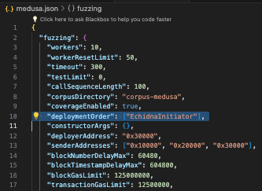
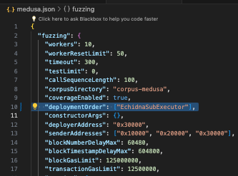

# Índice

- [Changes in Initiator and SubExecutor](#changes-in-initiator-and-subexecutor)
  - [Which changes made and why](#which-changes-made-and-why)
    - [Changes made in the Initiator contract](#changes-made-in-the-initiator-contract)
    - [Changes made in the SubExecutor contract](#changes-made-in-the-subexecutor-contract)
      - [function processPayment](#function-processpayment)
      - [function _processERC20Payment](#function-_processerc20payment)
- [Installation](#installation)
- [Init](#init)
- [Where to find the tests](#where-to-find-the-tests)
- [Testing Environments](#testing-environments)
  - [Foundry](#foundry)
    - [Resources to set up environment and understand approach](#resources-to-set-up-environment-and-understand-approach)
    - [Where are tests](#where-are-tests)
    - [How to run them](#how-to-run-them)
  - [Echidna](#echidna)
    - [Resources to set up environment and understand approach](#resources-to-set-up-environment-and-understand-approach-1)
    - [Where are tests](#where-are-tests-1)
    - [How to run them](#how-to-run-them-1)
  - [Medusa](#medusa)
    - [Resources to set up environment and understand approach](#resources-to-set-up-environment-and-understand-approach-2)
    - [Where are tests](#where-are-tests-2)
    - [How to run them](#how-to-run-them-2)
  - [Halmos](#halmos)
    - [Resources to set up environment and understand approach](#resources-to-set-up-environment-and-understand-approach-3)
    - [Where are tests](#where-are-tests-3)
    - [How to run them](#how-to-run-them-3)

# Changes in Initiator and SubExecutor

## Which changes made and why


### Changes made in the Initiator contract:


- We have provided a test function solely for instantiating the SubExecutor contract and ensuring that the call to it is correct.

```solidity
    ISubExecutor public subExecutor;

    function setSubExecutor(address _subExecutorAddress) external  {
        subExecutor = ISubExecutor(_subExecutorAddress);
        console.log("OK setSubExecutor");
    }
```

- We have included multiple logs to retrieve values at each interaction, allowing us to identify where the test passes and where it does not.
- Additionally, these logs have been utilized to track the flawless execution of the function up to a certain point and to visualize all the values.
- We have updated the interface to **subExecutor.processPayment();** to ensure correct interaction with the contract.

```solidity
    function initiatePayment(address _subscriber) public nonReentrant {
        ISubExecutor.SubStorage storage subscription = subscriptionBySubscriber[_subscriber];

        console.log("============" );
        console.log("validUntil ",subscription.validUntil);
        console.log("> block.timestamp",block.timestamp );
        console.log("============" );

        console.log("validAfter ",subscription.validAfter );
        console.log("< block.timestamp",block.timestamp );
        console.log("============" );

        console.log("amount > 0? =>",subscription.amount );
        console.log("============" );

        console.log("paymentInterval > 0? =>",subscription.paymentInterval );
        console.log("============" );
        console.log("/////////////////////////////////////////" );

        require(subscription.validUntil > block.timestamp, "Subscription is not active");
        require(subscription.validAfter < block.timestamp, "Subscription is not active");
        require(subscription.amount > 0, "Subscription amount is 0");
        require(subscription.paymentInterval > 0, "Payment interval is 0");

        console.log("THE CALL HAS PASSED ALL REQUIREMENTS" );


        // uint256 lastPaid = ISubExecutor(subscription.subscriber).getLastPaidTimestamp(address(this));
        // if (lastPaid != 0) {
        //     require(lastPaid + subscription.paymentInterval > block.timestamp, "Payment interval not yet reached");
        // }
        
        subExecutor.processPayment();
    }
```

### Changes made in the SubExecutor contract:

#### function processPayment

- We have included multiple logs to retrieve values at each interaction, allowing us to identify where the test passes and where it does not.
- Additionally, these logs have been utilized to track the flawless execution of the function up to a certain point and to visualize all the values.

```solidity
function processPayment() external nonReentrant {
        console.log("Within processPayment" );

        SubStorage storage sub = getKernelStorage().subscriptions[msg.sender];
        emit DebugSubExecutor(block.timestamp,  sub.validAfter);
        emit DebugSubExecutor(block.timestamp,  sub.validUntil);

        console.log("============" );
        console.log("block.timestamp ",block.timestamp );
        console.log(">= validAfter ",sub.validAfter );
        console.log("============" );

        console.log("block.timestamp ",block.timestamp );
        console.log("<= validUntil ", sub.validUntil);
        console.log("============" );

        console.log("msg.sender ==",sub.initiator );
        console.log("============" );
        console.log("/////////////////////////////////////////" );

        require(block.timestamp >= sub.validAfter, "Subscription not yet valid");
        require(block.timestamp <= sub.validUntil, "Subscription expired");
        require(msg.sender == sub.initiator, "Only the initiator can initiate payments");
        
        //Check when the last payment was done
        PaymentRecord[] storage paymentHistory = getKernelStorage().paymentRecords[msg.sender];
        if (paymentHistory.length > 0) {
            PaymentRecord storage lastPayment = paymentHistory[paymentHistory.length - 1];
            require(block.timestamp >= lastPayment.timestamp + sub.paymentInterval, "Payment interval not yet reached");
        } else {
            require(block.timestamp >= sub.validAfter + sub.paymentInterval, "Paco interval not yet reached");
        }

        console.log("Attempting to add a new PaymentRecord for", msg.sender);
        console.log("Payment amount:", sub.amount);
        console.log("Current timestamp:", block.timestamp);
        console.log("Subscriber:", sub.subscriber);

        getKernelStorage().paymentRecords[msg.sender].push(PaymentRecord(sub.amount, block.timestamp, sub.subscriber));
        // console.log("PaymentRecord added for", msg.sender);
        //Check whether it's a native payment or ERC20 or ERC721
        if (sub.erc20TokensValid) {
            _processERC20Payment(sub);
        } else {
            _processNativePayment(sub);
        }

        emit paymentProcessed(msg.sender, sub.amount);
    }
```

#### function _processERC20Payment

- We have added logs within this function to verify the user's balance and permissions before calling transferFrom.
- Furthermore, we have replaced transferFrom with transfer due to its behavior.

```solidity
    function _processERC20Payment(SubStorage storage sub) internal {
        IERC20 token = IERC20(sub.erc20Token);
        uint256 balance = token.balanceOf(address(this));
        console.log("ERC20 Token balance of SubExecutor:", balance);
        require(balance >= sub.amount, "Insufficient token balance");

        uint256 allowance = token.allowance(address(this), sub.initiator);
        console.log("Allowance for Initiator to spend SubExecutor's tokens:", allowance);
        require(allowance >= sub.amount, "Insufficient allowance");

        (bool success) = token.transfer(sub.initiator, sub.amount);
        require(success, "Transfer failed");
        console.log("ERC20 payment processed from SubExecutor to Initiator");
    }
```

## Installation

To be able to use this repository, you need to have the following installed:

- [Foundry]( https://book.getfoundry.sh/getting-started/installation)
- [Halmos](https://github.com/a16z/halmos/tree/main)
- [Echidna]( https://github.com/crytic/echidna?tab=readme-ov-file#installation)
- [Medusa](https://github.com/crytic/medusa?tab=readme-ov-file#installation)

## Init:

```js
 git submodule update --init --recursive
```
```js
sudo forge build -force
```

### You can find more information on this repository:
- [Example implementation](https://github.com/scab24/FV-FUZZ/blob/main/testing-campaigns/Olas-protocol.md)

  
## Where to find the tests

You can find the tests in various folders:

- Echidna and Medusa in the src/echidna folder
- Foundry in the test/Initiator/Foundry and test/SubExecutor/Foundry folders
- Halmos in the test/Initiator/Halmos and test/SubExecutor/Halmos folders
- Setup for Foundry and Halmos in the test/SetUp folder

# Testing Environments


## Foundry

### Resources to set up environment and understand approach

- [Documentation](https://book.getfoundry.sh/)
- [Create Invariant Tests for DeFi AMM Smart Contract](https://youtu.be/dWyJq8KGATg?si=JGYpABuOqR-1T6m3)

### Where are tests

- Foundry in the test/Initiator/Foundry and test/SubExecutor/Foundry folders

### How to run them

#### Initiator

- test/Initiator/Foundry/Fuzz/FuzzInitiator.sol
  
```solidity
forge test --mc FoundryInitiator_Fuzz_Test
```
- test/Initiator/Foundry/Unit/UnitInitiator.t.sol
  
```solidity
forge test --mc FoundryInitiator_Unit_Test
```
#### SubExecutor

- test/SubExecutor/Foundry/Fuzz/FuzzSubExecutor.t.sol
```solidity
forge test --mc SFoundrySubExecutor_Fuzz_Test
```
- test/SubExecutor/Foundry/Unit/UnitSubExecutor.t.sol
  
```solidity
forge test --mc SFoundrySubExecutor_Unit_Test
```


## Echidna

### Resources to set up environment and understand approach

- [Documentation](https://secure-contracts.com/index.html)
- [Properties](https://github.com/crytic/properties)
- [echidna](https://github.com/crytic/echidna)
- [Echidna Tutorial: #2 Fuzzing with Assertion Testing Mode](https://www.youtube.com/watch?v=em8xXB9RHi4&ab_channel=bloqarl)
- [Echidna Tutorial: #1 Introduction to create Invariant tests with Solidity](https://www.youtube.com/watch?v=yUC3qzZlCkY&ab_channel=bloqarl)


### Where are tests

- Echidna and Medusa in the src/echidna folder

### How to run them

#### Initiator

- src/echidna/EchidnaInitiator.sol

```solidity
 echidna . --contract EchidnaInitiator --config config.yaml
```
#### SubExecutor

- src/echidna/EchidnaSubExecutor.sol

```solidity
 echidna . --contract EchidnaSubExecutor --config config.yaml
```


## Medusa

### Resources to set up environment and understand approach

- [Documentation](https://github.com/crytic/medusa)
- [Properties](https://github.com/crytic/properties)
- [echidna](https://github.com/crytic/echidna)

### Where are tests

- Echidna and Medusa in the src/echidna folder

### How to run them

#### Initiator

- src/echidna/EchidnaInitiator.sol

To run Medusa with EchidnaInitiator, you need:

- Open the medusa.json file.
- Modify the section:
  - "deploymentOrder": ["EchidnaInitiator"],




```solidity
medusa fuzz
```
#### SubExecutor

- src/echidna/EchidnaSubExecutor.sol

To run Medusa with EchidnaSubExecutor, you need:

- Open the medusa.json file.
- Modify the section:
  - "deploymentOrder": ["EchidnaSubExecutor"],



```solidity
medusa fuzz    
```

## Halmos

### Resources to set up environment and understand approach

- [CheatCode](https://github.com/a16z/halmos-cheatcodes)
- [Documentation](https://github.com/a16z/halmos-cheatcodes)
- [Formal Verification In Practice: Halmos, Hevm, Certora, and Ityfuzz](https://allthingsfuzzy.substack.com/p/formal-verification-in-practice-halmos?r=1860oo&utm_campaign=post&utm_medium=web)
- [Examples](https://github.com/a16z/halmos/tree/main/examples)

### Where are tests

- Halmos in the test/Initiator/Halmos and test/SubExecutor/Halmos folders

### How to run them

#### Initiator

- test/Initiator/Halmos/Fuzz/FuzzHalmos.t.sol
  
```solidity
halmos --contract HalmosInitiatorTest --solver-timeout-assertion 0
```
```solidity
halmos --contract HalmosInitiatorTest --function "x" --solver-timeout-assertion 0
```

#### SubExecutor

- test/SubExecutor/Foundry/Fuzz/FuzzHalmosSubExecutor.t.sol
```solidity
halmos --contract HalmosSubExecutor_Fuzz_Test --solver-timeout-assertion 0
```
```solidity
halmos --contract HalmosSubExecutor_Fuzz_Test --function "x" --solver-timeout-assertion 0
```
